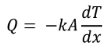

## INTRODUCTION 
The study of heat transfer in fins helps us to understand how fins work and how to design them to achieve the desired heat transfer rate. This knowledge can be used to improve the performance of many different devices and systems.
 
 
Here are some specific reasons why we study heat transfer in fins:
<ul>
<li>Fins can increase the surface area of a heat transfer surface by a factor of many times. This can significantly increase the rate of heat transfer.</li>
<li>Fins can be made from a variety of materials with different thermal conductivities. This allows us to tailor the heat transfer rate to the specific application.</li>
<li>Fins can be arranged in a variety of configurations to optimize the heat transfer rate.</li>
<li>
The study of heat transfer in fins can help us to understand the effects of different factors on the heat transfer rate, such as the fin length, the cross-sectional area, the thermal conductivity of the fin material, the temperature difference between the base surface and the fluid, and the velocity of the fluid.</li>
</ul>
The study of heat transfer in fins is a valuable tool for engineers and scientists who work in a variety of fields. It helps us to design and improve devices and systems that require heat transfer.
 
The heat transfer through a fin can be modeled using the fin equation. The fin equation is a differential equation that relates the heat transfer rate from the base surface to the fin geometry and the fluid conditions. 
 Temperature Difference for <b><i> a long fin</i></b> is: 

<i>Tat x = (Tbase - T∞).e-m.x 

 Heat Transfer Rate equation for <b><i> a long fin</i></b> is: 

<i>qf = &#177; &radic; (h.P.k.A.(Tb - T∞)) 
<!-- q = khA (Tbase - T∞) / L -->
<!--  -->

 where:
 qf is the heat transfer rate in watts
 k is the thermal conductivity of the fin material in watts per meter per kelvin
 h is the convective heat transfer coefficient between the fin and the fluid in watts per square meter per kelvin.
 A is the cross-sectional area of the fin in square meters
 Tbase is the temperature of the base surface of the fin in kelvins
 T∞ is the temperature of the fluid in kelvins
 L is the length of the fin in millimeters
 